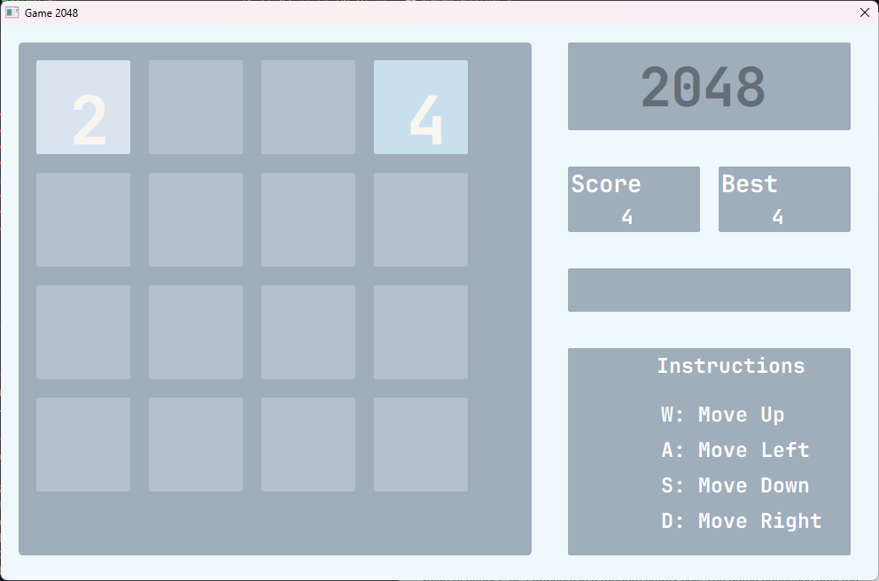
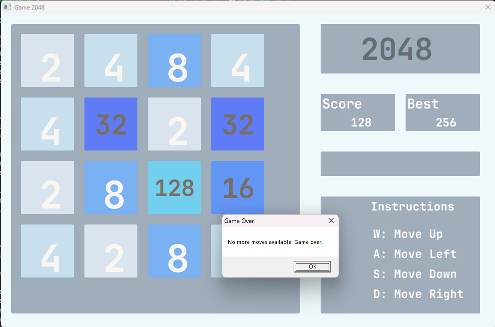
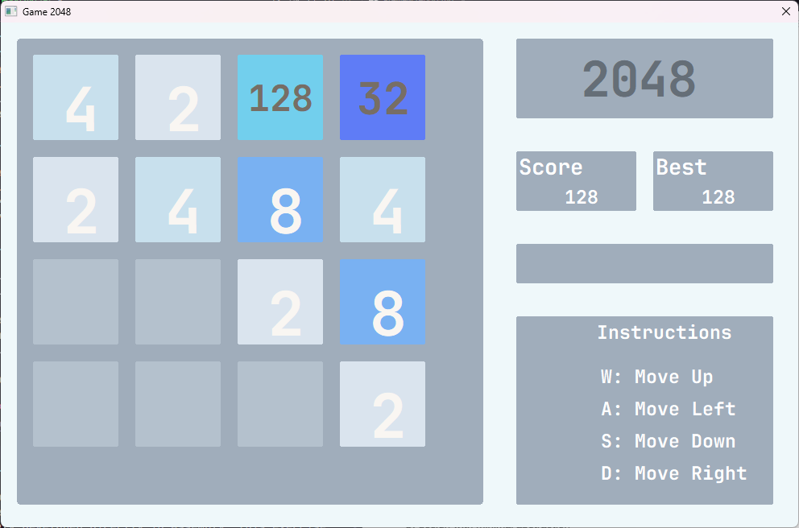

<style>
  Page {
    display: flex;
    height: 950px;
    flex-direction: column;
    justify-content: space-between;
  }
  Section {
    display: flex;
    flex-direction: column;
    align-items: center;
    justify-content: center;
  }
  HB-24 {
    font-size: 24pt;
    font-weight: bold;
    margin-bottom: 10px;
  }
  HB-18 {
    font-size: 18pt;
    font-weight: bold;
    margin-bottom: 10px;
  }
  H-16 {
    font-size: 16pt;
    margin-bottom: 10px;
  }
  Image {
    width: 300px;
    height: 300px;
  }
  HBI-14 {
    font-size: 14pt;
    font-weight: bold;
    font-style: italic;
    margin-bottom: 10px;
  }
  H-14 {
    font-size: 14pt;
    margin-bottom: 10px;
  }
  T-12 {
    font-size: 12pt;
  }
  .tdl {
    text-align: right;
    font-size: 12pt;
    border: none;
    padding: 0 10px 0 10px;
  }
  .tdr {
    font-size: 12pt;
    border: none;
    padding: 0 10px 0 10px;
  }
  .table {
    margin-right: auto;
    margin-left: auto;
  }
</style>

<Page>
  <section>
    <HB-24>Semester Project Report</HB-24>
    <HB-18>2048 Game Implementation in x86 Assembly (MASM)</HB-18>
    <H-16>(Semester 4, 2023)</H-16>
  </section>

  <section>
    <image src="C:\Users\ar69k\OneDrive - student.uet.edu.pk\Documents\University Stuff\Semester 4\uet-logo.png" alt="UET Logo" />
  </section>

  <section>
    <HBI-14>Submitted By</HBI-14>
    <table class="table">
      <tr>
        <td class="tdl">Abdul Rahman</td>
        <td class="tdr">2023-CS-725</td>
      </tr>
      <tr>
        <td class="tdl">Daniyal Jumshaid</td>
        <td class="tdr">2023-CS-734</td>
      </tr>
      <tr>
        <td class="tdl">Muhammad Zain</td>
        <td class="tdr">2023-CS-738</td>
      </tr>
      <tr>
        <td class="tdl">Sohaib Shaukat</td>
        <td class="tdr">2023-CS-740</td>
      </tr>
    </table>
  </section>

  <section>
    <HBI-14>Submitted To</HBI-14>
    <T-12>Prof. Maira Farooq</T-12>
  </section>

  <section>
    <HBI-14>Submission Date</HBI-14>
    <T-12>04/30/2025</T-12>
  </section>

  <section>
    <H-14>Department of Computer Science</H-14>
    <H-14>University of Engineering and Technology Lahore, New Campus</H-14>
  </section>
</Page>

## Table of Contents

1. [Introduction](#introduction)
2. [Project Objectives](#project-objectives)
3. [Methodology](#methodology)
4. [Implementation Details](#implementation-details)
   - [Game Interface](#game-interface)
   - [Game Logic](#game-logic)
   - [Drawing and UI](#drawing-and-ui)
   - [Score Tracking](#score-tracking)
5. [Key Functions](#key-functions)
6. [Use Cases](#use-cases)
7. [Challenges and Solutions](#challenges-and-solutions)
8. [Results](#results)
9. [Conclusion](#conclusion)
10. [References](#references)

## Introduction

2048 is a popular single-player sliding block puzzle game designed by Italian web developer Gabriele Cirulli in 2014. The game has simple rules but offers challenging gameplay. In our project, we've recreated this classic game using x86 Assembly language (MASM) with Win32 API for graphics and user interface.

The game is played on a 4×4 grid where the player must combine tiles with the same number to create a tile with the value of 2048. After each move, a new tile with a value of either 2 or 4 appears in a random empty cell. The game continues until the player either reaches a tile with 2048 (winning) or fills the grid with no possible moves (losing).


_Fig. 1: 2048 Game Main Screen_

## Project Objectives

1. Create a fully functional 2048 game with an interactive GUI
2. Implement the game logic in assembly language (MASM)
3. Provide keyboard controls for game movement
4. Track and display score information
5. Detect win/loss conditions and inform the player
6. Apply assembly language concepts learned during our course
7. Gain experience with Win32 API programming in assembly

## Methodology

### Development Environment

- **Assembler**: Microsoft Macro Assembler (MASM)
- **IDE**: Visual Studio Code
- **Platform**: Windows
- **APIs**: Win32 API (User32, GDI32, Kernel32)

### Development Approach

Our development approach followed these key steps:

1. **Research & Planning**: We researched the original 2048 game mechanics and planned the assembly implementation
2. **Base GUI Development**: Created a window framework using Win32 API calls
3. **Game Logic Implementation**: Developed core game mechanics (movement, merging, random number generation)
4. **Graphics & UI Enhancement**: Added colors, fonts, and visual elements
5. **Testing & Refinement**: Tested game functionality and refined the user experience

The modular approach allowed us to divide work among team members and integrate components incrementally.

## Implementation Details

### Game Interface

The game interface consists of:

- A 4x4 grid for game tiles
- Score display and best score tracking
- Game instructions
- Visual feedback with colored tiles

### Game Logic

The core game logic is implemented through several key procedures:

1. **Random Number Generation**

   - Implemented a Linear Congruential Generator (LCG) for random number placement
   - New tiles (value 2 or 4) appear after each valid move

2. **Movement Mechanics**

   - Four directional movements (Up, Down, Left, Right)
   - Controlled via W/A/S/D keys or arrow keys
   - Tiles slide to the edge of the board in the direction of movement

3. **Tile Merging**

   - Adjacent identical tiles combine when moved
   - Merged tiles double in value
   - Score increases based on merged tile values

4. **Game State Tracking**
   - Winning condition: Reaching a 2048 tile
   - Losing condition: No valid moves remaining
   - Option to continue in "infinite mode" after winning

### Drawing and UI

The UI is built using Win32 API GDI functions:

- CreateFont for text rendering
- CreateSolidBrush for colored tiles
- BitBlt for screen updates
- RoundRect for drawing rounded rectangles

Each number has a specific color scheme:

- Empty cells: Light gray
- 2, 4: Light beige
- 8, 16, 32, 64: Orange tones
- 128, 256, 512: Yellow tones
- 1024, 2048: Gold tones

### Score Tracking

- Current score based on highest tile value
- Best score saved and displayed
- Score updated dynamically after each move

## Key Functions

### Movement Functions

Our implementation includes four key movement functions:

1. **moveUp**: Handles upward tile movement and merging

```asm
moveUp proc
    ; Logic for moving tiles upward
    ; Checks for identical tiles and combines them
    ; Updates the score if merging occurs
    ; Returns a flag indicating if any movement occurred
moveUp endp
```

2. **moveDown**: Handles downward tile movement and merging

```asm
moveDown proc
    ; Logic for moving tiles downward
    ; Similar to moveUp but in reverse direction
moveDown endp
```

3. **moveLeft**: Handles leftward tile movement and merging

```asm
moveLeft proc
    ; Logic for moving tiles to the left
    ; Row-by-row processing
moveLeft endp
```

4. **moveRight**: Handles rightward tile movement and merging

```asm
moveRight proc
    ; Logic for moving tiles to the right
    ; Similar to moveLeft but in reverse direction
moveRight endp
```

### Random Number Generation

```asm
randomLCG proc
    ; Linear Congruential Generator for random number placement
    ; Finds empty cells in the grid
    ; Places a new tile with value 2 (90% chance) or 4 (10% chance)
randomLCG endp
```

### Game State Functions

```asm
canMove proc
    ; Tests if any moves are possible
    ; Used to detect game over condition
canMove endp

updateScore proc
    ; Updates the current score
    ; Checks for the 2048 tile (win condition)
updateScore endp
```

## Use Cases

### Use Case 1: Starting a New Game

**Actor**: Player
**Description**: Player launches the game and starts a new session
**Steps**:

1. Player launches the application
2. System initializes the game board with two random tiles (2 or 4)
3. System displays the initial game state, score set to 0
4. Game is ready for player input

### Use Case 2: Making a Move

**Actor**: Player
**Description**: Player makes a move in one of four directions
**Steps**:

1. Player presses W/Up Arrow (up), A/Left Arrow (left), S/Down Arrow (down), or D/Right Arrow (right)
2. System processes the move, sliding and merging tiles appropriately
3. If the move is valid (tiles moved or merged), system generates a new random tile
4. System updates the display and score
5. System checks for win/lose conditions

### Use Case 3: Winning the Game

**Actor**: Player
**Description**: Player combines tiles to reach 2048
**Steps**:

1. Player makes moves that result in a 2048 tile
2. System detects the 2048 tile and displays a win message
3. System prompts player to continue in infinite mode or end the game
4. If player chooses to continue, game proceeds with higher number combinations possible
5. If player chooses to end, application closes

### Use Case 4: Game Over

**Actor**: Player
**Description**: Player fills the board with no possible moves
**Steps**:

1. Player makes moves until no more valid moves are possible
2. System detects no possible moves and displays a game over message
3. System offers player to restart the game
4. If player chooses to restart, board is cleared and reinitialized
5. If player declines, application closes


_Fig. 2: Game Over Screen_

## Challenges and Solutions

### Challenge 1: Random Number Generation

**Problem**: Assembly doesn't have built-in random number generation.
**Solution**: Implemented a Linear Congruential Generator (LCG) algorithm that produces pseudo-random numbers using multiplication, addition, and modulo operations.

### Challenge 2: Tile Movement Logic

**Problem**: Managing the complex rules for tile movement and merging.
**Solution**: Created separate procedures for each direction with careful loop control. Used a flag system to ensure tiles only merge once per move.

### Challenge 3: Win32 GUI Programming

**Problem**: Creating a modern-looking GUI purely in assembly.
**Solution**: Leveraged Win32 API's GDI functions and designed a custom color scheme. Used transparency and rounded rectangles for a polished look.

### Challenge 4: Score Tracking

**Problem**: Calculating scores based on merged tiles.
**Solution**: Implemented a system that tracks the highest tile value on the board and updates the best score when surpassed.

### Challenge 5: Game State Tracking

**Problem**: Detecting when no more moves are possible.
**Solution**: Developed a simulation mechanism that tests all four directions on a copy of the game grid without actually applying the moves.

## Results

Our implementation successfully recreates the 2048 game with all its core features:

- Complete game mechanics matching the original
- Responsive user interface with keyboard controls
- Visual feedback with color-coded tiles
- Score tracking and best score persistence
- Win/lose detection with appropriate user prompts


_Fig. 3: Gameplay in Action_

## Conclusion

This project demonstrates the successful implementation of a complex game using Assembly language. While modern games are rarely developed directly in assembly, this exercise provided invaluable insights into low-level programming concepts:

- Memory management and optimization
- Efficient algorithm implementation
- UI design with minimal abstraction
- Event-driven programming in a low-level language

Through this project, we've gained a deeper understanding of computer architecture and how high-level programming concepts translate to machine-level operations.

### Future Improvements

With more time, we would consider adding:

- Animation for tile movements and merges
- Sound effects and music
- Undo functionality
- Game state saving for resuming later
- Option for different grid sizes

## References

1. Microsoft MASM Documentation
2. Win32 API Documentation
3. Gabriele Cirulli's original 2048 game: https://play2048.co/
4. "Assembly Language for x86 Processors" by Kip R. Irvine
5. Tutorial: x86 Assembly Language Programming with MASM
